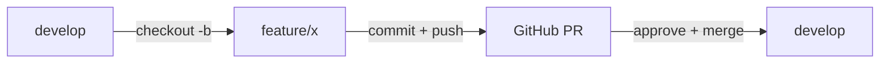
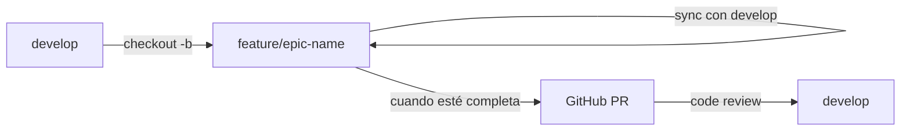

# ✅ Configuración de Ramas Completada - OmniPOS

> Resumen de la configuración de Git Flow y próximos pasos

**Fecha:** 2025-01-27  
**Estado:** ✅ Completado

---

## 🎉 ¿Qué se ha hecho?

### 1. ✅ Commits Guardados
- **Commit principal**: `9c9c2bf`
  - Docker support con SQL Server 2022
  - API layer con REST endpoints
  - Clean Architecture (Domain, Application, Infrastructure)
  - Scripts SQL de inicialización
  - Documentación completa

### 2. ✅ Estructura de Ramas Creada

```
📦 omnipos-winforms-mvp
├── 🟢 master         (producción - protegida)
├── 🟡 develop        (testing/UAT - protegida)  ← TU RAMA PRINCIPAL DE TRABAJO
└── ⚠️  toBeReleased  (legacy - deprecada)
```

### 3. ✅ Documentación Agregada

| Archivo | Descripción |
|---------|-------------|
| `README.md` | README principal del proyecto actualizado |
| `docs/BRANCHING_STRATEGY.md` | Estrategia completa de Git Flow |
| `docs/GIT_FLOW_QUICK_GUIDE.md` | Guía rápida con comandos del día a día |

### 4. ✅ Estado Actual de Ramas

```bash
* develop        → 4dbef6f (3 commits adelante de master)
* master         → 9c9c2bf (código base sincronizado)
* toBeReleased   → 9c9c2bf (misma posición que master)
```

---

## 🚀 Próximos Pasos

### 1. Configurar Protección de Ramas en GitHub

**Para `master`:**
1. Ir a: https://github.com/huanre94/omnipos-winforms-mvp/settings/branches
2. Click "Add branch protection rule"
3. Branch name pattern: `master`
4. Marcar:
   - ✅ Require pull request before merging
   - ✅ Require approvals: 1
   - ✅ Require status checks to pass before merging
   - ✅ Include administrators (opcional)
5. Click "Create"

**Para `develop`:**
1. Repetir proceso anterior
2. Branch name pattern: `develop`
3. Mismas opciones (o más relajadas si eres solo tú)

### 2. Empezar a Trabajar con Features

#### Opción A: Continuar con trabajo existente
Si ya estás trabajando en algo:
```bash
# Crear feature branch desde develop
git checkout develop
git checkout -b feature/nombre-descriptivo

# Continuar trabajando...
```

#### Opción B: Empezar nueva funcionalidad
```bash
# Ejemplo: implementar búsqueda de productos
git checkout develop
git pull origin develop
git checkout -b feature/product-search-improvements

# Hacer cambios...
git add .
git commit -m "feat: improve product search with filters"
git push -u origin feature/product-search-improvements

# Crear Pull Request en GitHub hacia develop
```

---

## 📚 Guías Rápidas

### Comando más usado del día a día:
```bash
# Crear nueva feature
git checkout develop && git pull && git checkout -b feature/mi-feature

# Trabajar...
git add . && git commit -m "feat: descripción"
git push -u origin feature/mi-feature

# Crear PR en GitHub
```

### Ver estado de tu trabajo:
```bash
git status           # Ver archivos modificados
git branch           # Ver rama actual
git log --oneline -5 # Ver últimos 5 commits
```

### Mantener feature actualizada:
```bash
git checkout feature/mi-feature
git fetch origin
git rebase origin/develop
git push --force-with-lease
```

---

## 🎯 Workflow Recomendado

### Para Features Pequeñas (1-2 días)


### Para Features Grandes (sprint completo)


---

## 🔗 Enlaces Importantes

### GitHub
- **Repositorio**: https://github.com/huanre94/omnipos-winforms-mvp
- **Issues**: https://github.com/huanre94/omnipos-winforms-mvp/issues
- **Pull Requests**: https://github.com/huanre94/omnipos-winforms-mvp/pulls
- **Milestones**: https://github.com/huanre94/omnipos-winforms-mvp/milestones
- **Branch Protection**: https://github.com/huanre94/omnipos-winforms-mvp/settings/branches

### Documentación
- [📖 Branching Strategy](../docs/BRANCHING_STRATEGY.md) - Estrategia completa
- [🚀 Git Flow Quick Guide](../docs/GIT_FLOW_QUICK_GUIDE.md) - Comandos rápidos
- [🐳 Docker Guide](../docs/DOCKER_GUIDE.md) - Setup de desarrollo
- [📋 docs/README.md](../docs/README.md) - Índice de documentación

---

## 🎓 Recordatorios Importantes

### ✅ HACER:
- ✅ Siempre trabajar en ramas `feature/*`, `bugfix/*`, etc.
- ✅ Pull de `develop` antes de crear nueva rama
- ✅ Commits frecuentes con mensajes descriptivos
- ✅ Push frecuente (backup en la nube)
- ✅ Crear Pull Requests para mergear a `develop`
- ✅ Eliminar ramas después de mergear

### ❌ NO HACER:
- ❌ **NUNCA** push directo a `master` o `develop`
- ❌ Commits gigantes con muchos cambios
- ❌ Mensajes vagos: "fix", "update", "cambios"
- ❌ Dejar ramas viejas sin eliminar
- ❌ Ignorar conflictos de merge

---

## 🔍 Estado de Documentación

### Archivos Creados/Actualizados:
```
✅ README.md                           (actualizado)
✅ docs/BRANCHING_STRATEGY.md          (nuevo)
✅ docs/GIT_FLOW_QUICK_GUIDE.md       (nuevo)
✅ docs/BRANCH_SETUP_SUMMARY.md       (este archivo)
✅ docs/DOCKER_GUIDE.md                (existente)
✅ docs/01-architecture.md             (existente)
✅ docs/02-modules-backend.md          (existente)
✅ docs/03-migration-plan.md           (existente)
✅ docs/05-project-structure.md        (existente)
✅ docs/06-phase1-implementation-guide.md (existente)
```

---

## 📊 Comparación de Ramas

### `develop` vs `master`
```bash
# Ver diferencias
git log master..develop --oneline

# Resultado actual:
# 4dbef6f docs: add Git Flow quick reference guide
# 0c7fcc0 docs: update main README with project overview and branching info
# aaae900 docs: add branching strategy and Git Flow guidelines
```

`develop` tiene 3 commits de documentación adelante de `master`. Esto es correcto y esperado.

---

## 🎬 Ejemplo Completo de Workflow

### Día 1: Empezar nueva feature
```bash
# Mañana
cd C:\Users\HugoRestrepo\Documents\hrestrepo\omnipos-winforms-mvp
git checkout develop
git pull origin develop
git checkout -b feature/customer-credit-validation

# Trabajar en Visual Studio...
# Implementar validación de crédito de clientes

# Tarde
git add .
git commit -m "feat(customer): add credit limit validation logic"
git push -u origin feature/customer-credit-validation
```

### Día 2: Continuar feature
```bash
# Actualizar con últimos cambios de develop
git fetch origin
git rebase origin/develop

# Seguir trabajando...
git add .
git commit -m "feat(customer): add UI for credit validation"
git push
```

### Día 3: Finalizar feature
```bash
# Último commit
git add .
git commit -m "feat(customer): add unit tests for credit validation"
git push

# Crear Pull Request en GitHub
# Base: develop ← Compare: feature/customer-credit-validation

# Después de aprobar y mergear:
git checkout develop
git pull origin develop
git branch -d feature/customer-credit-validation
```

---

## 🆘 ¿Necesitas Ayuda?

### Comandos de Consulta Rápida
```bash
# ¿En qué rama estoy?
git branch

# ¿Qué he modificado?
git status

# ¿Qué ramas existen?
git branch -a

# Ver últimos commits
git log --oneline -10
```

### Guías Disponibles
1. **Comandos básicos**: [docs/GIT_FLOW_QUICK_GUIDE.md](../docs/GIT_FLOW_QUICK_GUIDE.md)
2. **Estrategia completa**: [docs/BRANCHING_STRATEGY.md](../docs/BRANCHING_STRATEGY.md)
3. **Conventional Commits**: [docs/BRANCHING_STRATEGY.md#convenciones-de-commits](../docs/BRANCHING_STRATEGY.md#-convenciones-de-commits)

---

## ✨ Todo Listo!

Tu repositorio ahora tiene:
- ✅ Estructura de ramas profesional (Git Flow)
- ✅ Documentación completa y actualizada
- ✅ Guías rápidas de referencia
- ✅ Todos los cambios commiteados y pusheados

**Próximo paso:** Configurar protección de ramas en GitHub y empezar a trabajar con features.

¡Feliz coding! 🚀

---

**Configuración realizada por:** GitHub Copilot  
**Fecha:** 2025-01-27  
**Repositorio:** https://github.com/huanre94/omnipos-winforms-mvp
